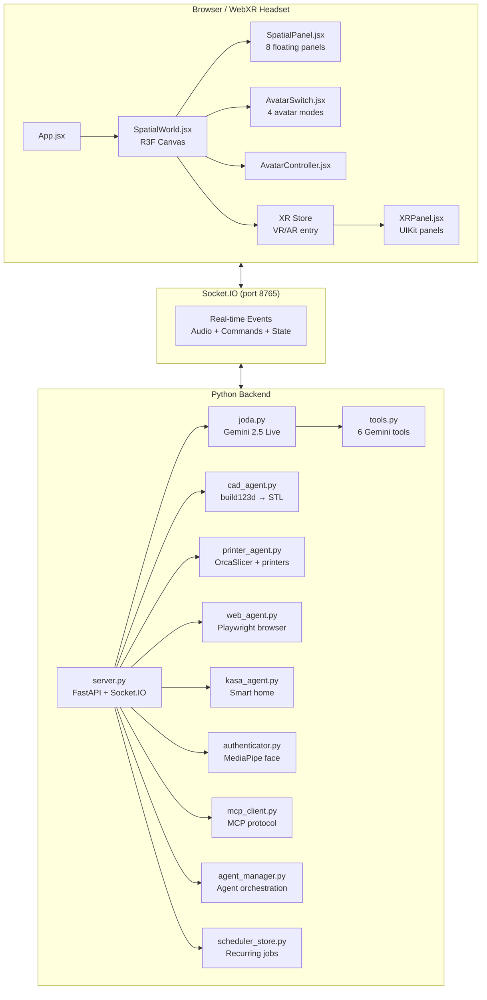

<p align="center">
  
</p>

<h1 align="center">J.O.D.A</h1>
<p align="center"><strong>Jarvis's Operative Developer Assistant</strong></p>

<p align="center">
  
  
  
  
  
  
</p>

<p align="center">
  A voice-first AI assistant that lives in a spatial 3D world.<br/>
  Talk to it. Ask it to design parts. Print them. Control your lights. Browse the web. Deploy agents.<br/>
  All from inside a holographic workspace you can walk into with a VR headset.
</p>

---

## The Origin Story

Depending on who you ask, JODA came into existence three different ways. All of them are true.

### The Engineer's Account

It started with **ADA** — a Gemini-powered voice assistant built to do one thing well: listen and respond in real time using Google's native audio API. ADA worked. You could talk to it, and it would talk back with sub-second latency. It could generate images, write files, and control smart devices.

But ADA lived in a flat world. A 2D split-screen layout where an avatar sat on the left and chat sat on the right. Every new feature — CAD viewer, printer controls, browser automation — became another panel fighting for screen space. The interface was becoming a dashboard, not an experience.

Then came **OpenClaw**. A multi-agent framework built around a radical idea: AI assistants shouldn't be monoliths. They should be ecosystems — collections of specialized agents that discover each other, share tools, and coordinate through protocols like MCP. OpenClaw showed that a single assistant could orchestrate a fleet of capabilities without becoming a tangled mess.

The rewrite happened in a weekend. ADA's voice engine was transplanted into a full-screen React Three Fiber canvas. Panels became spatial objects floating in 3D space. The avatar became a holographic entity you could walk around. WebXR support meant the whole thing could run in a VR headset. The 2D dashboard became a 3D workspace.

ADA became JODA. The voice was reborn in three dimensions.

### The Sci-Fi Version

A developer sits at their desk, talking to an AI that floats in a holographic workspace. They say "design me a gear with 24 teeth" and watch geometry materialize in the air. They say "print it" and a machine across the room starts humming. They say "dim the lights" and the room goes dark except for the glow of the avatar.

It's Iron Man's JARVIS meets the holodeck — except it runs on a laptop with a $20/month API key. Born from the ashes of a simpler assistant called ADA, rebuilt from the ground up for spatial computing.

### The Mythic Version

> "Do, or do not. There is no try."

JODA is the wise guide through a developer's digital universe. It doesn't just answer questions — it shapes matter, commands machines, and orchestrates agents across networks. Ancient wisdom encoded in neon geometry. A master that teaches by doing.

The name is not a coincidence.

### Credits

JODA stands on the shoulders of two projects:

- **[OpenClaw](https://github.com/openclaw/openclaw)** — the lobster that showed us AI assistants belong everywhere. Its multi-agent architecture and MCP-first philosophy shaped how JODA orchestrates tools, agents, and external services.
- **[ADA](https://github.com/nazirlouis/ada_v2)** — where the voice was born. ADA's Gemini Live audio engine is the beating heart of JODA's real-time conversation system.

---

## Capabilities at a Glance

| Category | Feature | Details |
|----------|---------|---------|
| **Voice** | Real-time conversation | Gemini 2.5 Live API, sub-second latency, interrupt support |
| **Voice** | Browser mic input | 16kHz PCM streaming from any device |
| **3D World** | Spatial panels | 8 floating panels in 3D space (chat, tools, CAD, browser, etc.) |
| **3D World** | Avatar system | 4 modes: beautiful GLB, full-body GLB, procedural 3D, holographic SVG |
| **3D World** | WebXR | Walk into the workspace with VR/AR headsets |
| **CAD** | Parametric design | Natural language → build123d → STL via `cad_agent.py` |
| **CAD** | Iterative refinement | "Make it thicker" — modifies existing designs |
| **Printing** | Network discovery | Auto-detect OctoPrint/Klipper/Bambu printers |
| **Printing** | Slice & print | OrcaSlicer profiles → direct print |
| **Smart Home** | Kasa devices | Discover, toggle, dim, change color of TP-Link devices |
| **Browser** | Web automation | Playwright-based browsing, screenshots, form filling |
| **Agents** | Agent deployment | FreqTrade, Hummingbot, RL trading, arbitrage, data collectors |
| **Agents** | MCP integration | Discover and call tools from MCP servers |
| **Scheduler** | Recurring tasks | Cron or interval-based job scheduling |
| **Auth** | Face recognition | MediaPipe-based local face auth (never uploaded) |
| **Media** | Image/video generation | AI-powered content creation |
| **Files** | Read/write | File system access with confirmation prompts |
| **Memory** | Conversation persistence | Save/load long-term memory contexts |

---

## Screenshots / Demo

> *Screenshots coming soon. In the meantime, run `npm run dev` and see for yourself.*

---

## Quick Start

```bash
# Clone
git clone https://github.com/nazirlouis/joda_ai_local.git
cd joda_ai_local

# Environment
cp .env.example .env
# Edit .env with your GEMINI_API_KEY (required) and optional keys

# Install
npm install
pip install -r requirements.txt

# Run (starts both frontend + backend)
npm run dev
```

Open `http://localhost:5173` in your browser. Click the microphone to start talking.

---

## Architecture Overview



**Key architectural decisions:**

- **Single R3F Canvas**: The entire UI lives inside one `<Canvas>` — no nested Canvas conflicts. CadWindow is the one exception (2D overlay).
- **Ref-based audio bridge**: Avatar audio data flows through refs (not state) at 30-60Hz to avoid re-renders. `RefBridge` in AvatarSwitch scopes state updates to the avatar subtree only.
- **Spatial positions**: Each panel's 3D position is stored in `spatialPositions` state with defaults from `DEFAULT_POSITIONS`.
- **AI model fallback**: Gemini → OpenAI (gpt-5) → Ollama local.

---

## WebXR Support

JODA's spatial world is WebXR-ready. Put on a headset and walk into your workspace.

### Supported Headsets

| Headset | Mode | Status |
|---------|------|--------|
| Apple Vision Pro | AR (passthrough) | Supported |
| Meta Quest 3/Pro | VR + AR | Supported |
| XReal Air | AR | Experimental |
| Any WebXR browser | VR | Supported |

### How It Works

JODA uses a dual-path rendering strategy:

- **Desktop**: Panels render as `drei Html` components anchored to 3D positions
- **WebXR**: Panels switch to `@react-three/uikit` native XR rendering via `XRPanel.jsx`

The `xrStore.js` manages XR session state. Entry buttons (VR/AR) appear in the toolbar when WebXR is available.

### V1 (Current)

- Immersive VR/AR session entry
- Life-sized avatar placement (`XRAvatarPlacement`)
- Controller and hand tracking input
- Spatial panels visible in XR

### V2 (Planned)

- Hand gesture commands (pinch to confirm, wave to cancel)
- Gaze-based panel interaction
- Room-scale panel anchoring
- Shared multi-user sessions

---

## Installation

### Prerequisites

- **Node.js** 18+ and npm
- **Python** 3.11+
- **Gemini API key** (required for voice) — get one at [aistudio.google.com](https://aistudio.google.com)

### Beginner Path

```bash
git clone https://github.com/nazirlouis/joda_ai_local.git
cd joda_ai_local
cp .env.example .env
# Add your GEMINI_API_KEY to .env

npm install
pip install -r requirements.txt
npm run dev
```

### Developer Path

```bash
git clone https://github.com/nazirlouis/joda_ai_local.git
cd joda_ai_local

# Python environment
python -m venv venv
source venv/bin/activate  # or venv\Scripts\activate on Windows
pip install -r requirements.txt

# Frontend
npm install

# Configuration
cp .env.example .env
# Edit .env — see Configuration section below

# Run with hot reload
npm run dev
```

### Optional Dependencies

| Dependency | Purpose | Install |
|------------|---------|---------|
| OrcaSlicer | 3D print slicing | [Download](https://github.com/SoftFever/OrcaSlicer) |
| build123d | CAD generation | `pip install build123d` |
| Playwright | Web automation | `pip install playwright && playwright install` |
| python-kasa | Smart home | `pip install python-kasa` |
| MediaPipe | Face auth + gestures | Included in requirements.txt |

---

## Configuration

### Environment Variables (.env)

| Variable | Required | Description |
|----------|----------|-------------|
| `GEMINI_API_KEY` | Yes | Google Gemini API key |
| `OPENAI_API_KEY` | No | OpenAI fallback key |
| `OLLAMA_HOST` | No | Ollama server URL (default: `http://localhost:11434`) |
| `FAL_KEY` | No | Fal.ai key for image/video generation |
| `HEYGEN_API_KEY` | No | HeyGen avatar streaming |
| `JUDGE0_API_KEY` | No | Code execution service |
| `LIVEKIT_URL` | No | LiveKit server for WebRTC |
| `LIVEKIT_API_KEY` | No | LiveKit API key |
| `LIVEKIT_API_SECRET` | No | LiveKit secret |

### Settings (backend/settings.json)

Runtime settings are stored in `backend/settings.json` and can be modified through the Settings panel or via Socket.IO:

- `tool_permissions` — Per-tool auto-allow/deny/ask
- `face_auth_enabled` — Enable face authentication
- `camera_flipped` — Mirror camera feed

---

## Running JODA

### Development Mode

```bash
npm run dev
```

This starts both the Vite dev server (port 5173) and the Python backend (port 8765) using `concurrently`.

### Production Build

```bash
npm run build
# Serve dist/ with any static server
# Run backend separately: python backend/server.py
```

### Remote Access (HTTPS Required for Mic)

Browser microphone access requires HTTPS. For remote/VPS deployments:

**Option 1: Cloudflare Tunnel**
```bash
cloudflared tunnel --url http://localhost:5173
```

**Option 2: nginx reverse proxy with SSL**
```nginx
server {
    listen 443 ssl;
    server_name joda.yourdomain.com;

    ssl_certificate /path/to/cert.pem;
    ssl_certificate_key /path/to/key.pem;

    location / {
        proxy_pass http://localhost:5173;
        proxy_http_version 1.1;
        proxy_set_header Upgrade $http_upgrade;
        proxy_set_header Connection "upgrade";
    }

    location /socket.io/ {
        proxy_pass http://localhost:8765;
        proxy_http_version 1.1;
        proxy_set_header Upgrade $http_upgrade;
        proxy_set_header Connection "upgrade";
    }
}
```

---

## Commands & Tools

### Voice Commands

Speak naturally — JODA understands intent, not keywords. Examples:

- "Design a spur gear with 24 teeth and module 2"
- "Print the last model on the Bambu printer"
- "Turn off the living room lights"
- "Open YouTube and search for Three.js tutorials"
- "Deploy a FreqTrade bot for BTC/USDT"
- "Schedule a daily report at 9am"

### Slash Commands (Text Input)

| Command | Description |
|---------|-------------|
| `/projects` | List and manage JODA projects |
| `/ralph <project> <prompt>` | Run Ralph orchestrator against a project |
| `/skills` | List available browser automation skills |
| `/scheduler` or `/schedule` | Manage scheduled jobs |

### Gemini Tools

These tools are available to the AI during conversation:

| Tool | Description |
|------|-------------|
| `generate_cad_prototype` | Generate parametric 3D models from descriptions |
| `generate_image` | Create AI-generated images |
| `generate_video` | Create AI-generated video clips |
| `write_file` | Write content to files (requires confirmation) |
| `read_file` | Read file contents |
| `read_directory` | List directory contents |

### Agent Types

| Agent | Description |
|-------|-------------|
| `freqtrade` | Crypto trading bot (FreqTrade) |
| `hummingbot` | Market making bot (Hummingbot) |
| `rl_trading` | Reinforcement learning trader |
| `arbitrage` | Cross-exchange arbitrage |
| `data_collector` | Market data collection |

---

## Project Structure

```
joda_ai_local/
├── src/                          # React frontend
│   ├── App.jsx                   # Root component + Socket.IO connection
│   ├── main.jsx                  # Entry point
│   ├── xrStore.js                # WebXR session store
│   ├── components/
│   │   ├── SpatialWorld.jsx      # Full-screen R3F Canvas
│   │   ├── SpatialPanel.jsx      # 3D panel positioning + Html anchoring
│   │   ├── spatialContext.js     # React context for spatial state
│   │   ├── AvatarSwitch.jsx      # Avatar mode selector + RefBridge
│   │   ├── AvatarController.jsx  # Avatar interaction logic
│   │   ├── BeautifulAvatar.jsx   # GLB beautiful avatar
│   │   ├── FullBodyAvatar.jsx    # GLB full-body avatar
│   │   ├── AvatarCustomizer.jsx  # Appearance customization
│   │   ├── JodaAvatar.jsx        # Original procedural avatar
│   │   ├── XRPanel.jsx           # WebXR UIKit panel rendering
│   │   ├── CadWindow.jsx         # CAD viewer (2D overlay)
│   │   ├── ChatModule.jsx        # Chat interface
│   │   ├── PrinterWindow.jsx     # Printer control + slicing
│   │   ├── BrowserWindow.jsx     # Browser automation display
│   │   ├── KasaWindow.jsx        # Smart home controls
│   │   ├── SettingsWindow.jsx    # App settings
│   │   ├── ToolsModule.jsx       # AI tools panel
│   │   ├── MediaGalleryWindow.jsx # Generated media gallery
│   │   ├── MemoryPrompt.jsx      # Memory management
│   │   ├── AuthLock.jsx          # Face authentication
│   │   ├── ConfirmationPopup.jsx # Tool confirmation dialog
│   │   └── xr/                   # XR-specific components
│   └── styles/
├── backend/                      # Python backend
│   ├── server.py                 # FastAPI + Socket.IO server
│   ├── joda.py                   # Gemini 2.5 Live API integration
│   ├── tools.py                  # Gemini tool definitions
│   ├── cad_agent.py              # build123d CAD generation
│   ├── printer_agent.py          # Printer discovery + OrcaSlicer
│   ├── web_agent.py              # Playwright browser automation
│   ├── kasa_agent.py             # TP-Link smart home
│   ├── authenticator.py          # MediaPipe face auth
│   ├── agent_manager.py          # Agent deployment framework
│   ├── mcp_client.py             # MCP protocol client
│   ├── scheduler_store.py        # Job scheduling
│   ├── project_manager.py        # Project context management
│   ├── media_generators.py       # Image/video generation
│   ├── browser_use_agent.py      # Browser-use integration
│   ├── settings.json             # Runtime settings
│   └── mcp_servers.json          # MCP server registry
├── external_tools/               # External integrations
│   ├── pinokio/                  # Pinokio launcher
│   ├── judge0/                   # Code execution
│   └── zimage/                   # Z-Image models
├── projects/                     # User project data
├── yoda/                         # Agent Zero framework
├── public/                       # Static assets
├── docs/                         # Documentation
│   └── sdk/                      # SDK guides + examples
├── vite.config.js
├── tailwind.config.js
├── package.json
├── requirements.txt
└── .env                          # API keys (not committed)
```

---

## SDK

JODA exposes a Socket.IO-based API that lets you build plugins (extend JODA) and clients (connect to JODA from external apps).

- **[SDK Overview](docs/sdk/README.md)** — Architecture and quick links
- **[Plugin SDK](docs/sdk/plugin-sdk.md)** — Add custom tools, panels, and avatar modes
- **[Client SDK](docs/sdk/client-sdk.md)** — Connect to JODA from any language
- **[Events Reference](docs/sdk/events-reference.md)** — Complete Socket.IO event catalog

---

## Known Limitations

- **WebXR panel interaction** — XR panels are visible but not yet interactive via hand/gaze input
- **Single user** — One active voice session at a time per backend instance
- **Gemini dependency** — Voice requires a Gemini API key; text-only fallback uses OpenAI/Ollama
- **OrcaSlicer path** — Slicer must be installed separately and path configured
- **Browser automation** — Playwright requires headed mode for some sites; CAPTCHA handling is limited
- **Face auth** — Works best with consistent lighting; single-face reference only
- **Electron** — Desktop app packaging is available but not actively maintained; browser-first recommended

---

## Contributing

Contributions are welcome. Here's how to get started:

1. Fork the repository
2. Create a feature branch: `git checkout -b feature/your-feature`
3. Make your changes
4. Test locally: `npm run dev`
5. Commit with a descriptive message
6. Open a pull request against `main`

### Areas Where Help Is Wanted

- WebXR panel interaction (gaze + hand input)
- Additional avatar modes and animations
- MCP server integrations
- Mobile-responsive 2D fallback
- Test coverage

---

## Security

- **Face data**: Processed locally via MediaPipe. Never uploaded to any server.
- **Browser credentials**: Stored in memory only (session-scoped). Cleared on disconnect.
- **API keys**: Stored in `.env` (gitignored). Never logged or transmitted.
- **File operations**: `write_file` tool requires explicit user confirmation before executing.
- **Tool permissions**: Configurable per-tool auto-allow/deny/ask in settings.

---

## Acknowledgments

JODA is built with and inspired by:

- **[OpenClaw](https://github.com/openclaw/openclaw)** — Multi-agent AI framework that shaped JODA's architecture
- **[ADA](https://github.com/nazirlouis/ada_v2)** — The voice assistant where it all began
- **[Google Gemini](https://ai.google.dev/)** — Real-time voice AI via the Live API
- **[React Three Fiber](https://docs.pmnd.rs/react-three-fiber)** — React renderer for Three.js
- **[Three.js](https://threejs.org/)** — 3D graphics engine
- **[@react-three/xr](https://github.com/pmndrs/xr)** — WebXR integration for R3F
- **[build123d](https://github.com/gumyr/build123d)** — Parametric CAD in Python
- **[MediaPipe](https://developers.google.com/mediapipe)** — Face recognition and hand tracking
- **[OrcaSlicer](https://github.com/SoftFever/OrcaSlicer)** — 3D print slicing
- **[Socket.IO](https://socket.io/)** — Real-time bidirectional communication
- **[Playwright](https://playwright.dev/)** — Browser automation

---

## License

MIT License. See [LICENSE](LICENSE) for details.
