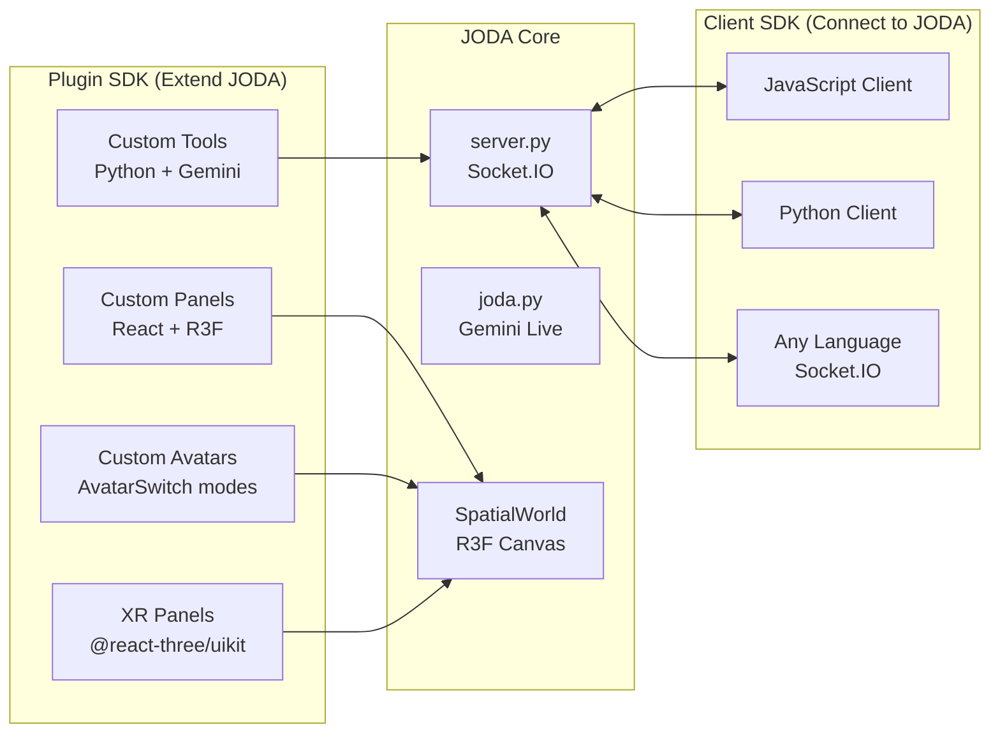

# JODA SDK

The JODA SDK has two halves:

- **Plugin SDK** — Extend JODA by adding custom tools, panels, and avatar modes
- **Client SDK** — Connect to JODA from external applications over Socket.IO

## Quick Links

| Guide | Description |
|-------|-------------|
| [Plugin SDK](plugin-sdk.md) | Add tools, panels, and avatar modes to JODA |
| [Client SDK](client-sdk.md) | Connect to JODA from any language |
| [Events Reference](events-reference.md) | Complete Socket.IO event catalog |

## Examples

| Example | Language | Description |
|---------|----------|-------------|
| [weather-tool.py](examples/weather-tool.py) | Python | Custom Gemini tool plugin |
| [remote-client.js](examples/remote-client.js) | JavaScript | Remote Socket.IO client |
| [custom-panel.jsx](examples/custom-panel.jsx) | React/JSX | Custom spatial panel |

## Extension Points

### Python (Backend)

1. **Tool definitions** — Add entries to `tools_list` in `backend/tools.py`
2. **Tool handlers** — Add handler logic in `backend/server.py` (tool execution section)
3. **Socket.IO events** — Register new `@sio.on()` handlers in `backend/server.py`
4. **Agents** — Add new agent types to `backend/agent_manager.py`

### React (Frontend)

1. **Spatial panels** — Create a component and register it in `SpatialPanel.jsx` with a position in `DEFAULT_POSITIONS`
2. **Avatar modes** — Add a new mode branch in `AvatarSwitch.jsx`
3. **XR panels** — Create an `XRPanel`-compatible component for WebXR rendering
4. **Socket.IO events** — Listen/emit in `App.jsx` where the socket connection is managed

### Configuration

1. **MCP servers** — Register external tool servers in `backend/mcp_servers.json`
2. **Tool permissions** — Configure auto-allow/deny/ask in `backend/settings.json`
3. **Slicer profiles** — Add OrcaSlicer profiles to `backend/printer_profiles/`
